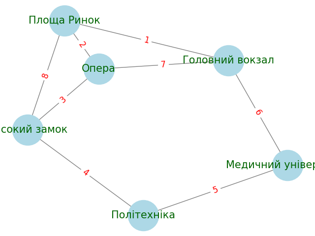

# Graph Theory

This project involves understanding and implementing fundamental graph algorithms using the `networkX` library in Python. The tasks include creating and analyzing graphs, implementing DFS and BFS, and applying Dijkstra's algorithm.

## Tasks

### Task 1: Graph Creation and Analysis

**Description**:

- Create a graph to model a real-world network. This can be a transportation network (e.g., city roads), a social network (e.g., friendships), or an internet topology.
- **Steps**:
  1. **Graph Construction**: Use the `networkX` library to build the graph.
  2. **Visualization**: Render a visual representation of the graph to understand its structure.
  3. **Analysis**: Examine key characteristics of the graph, including:
     - Number of vertices (nodes)
     - Number of edges (connections)
     - Degree of vertices (number of connections each node has)

### Task 2: Depth-First Search (DFS) and Breadth-First Search (BFS)

**Description**:

- Implement two fundamental search algorithms, DFS and BFS, to explore paths within the graph created in Task 1.
- **Steps**:
  1. **DFS Implementation**: Write a program to perform depth-first search and find paths in the graph.
  2. **BFS Implementation**: Write a program to perform breadth-first search and find paths in the graph.
  3. **Comparison**: Compare the results from both algorithms. Discuss:
     - How the paths differ between DFS and BFS
     - Why these differences occur based on the nature of each algorithm (depth-first vs. breadth-first)

### Task 3: Dijkstra's Algorithm

**Description**:

- Apply Dijkstra's algorithm to find the shortest paths in the graph.
- **Steps**:
  1. **Add Weights**: Assign weights (e.g., distances or costs) to the edges of the graph.
  2. **Algorithm Implementation**: Implement Dijkstra's algorithm to compute the shortest path between all pairs of vertices.
  3. **Shortest Path Calculation**: Output the shortest path lengths and routes for each pair of vertices.

### Results:

## Task 1

# Analysis of Lviv's Public Transport Network

## Graph Representation

The provided code creates an undirected graph representing the public transport routes in Lviv with six stations:

- Головний вокзал
- Площа Ринок
- Опера
- Високий замок
- Політехніка
- Медичний університет

### Edges (Routes)

1. Головний вокзал - Площа Ринок
2. Площа Ринок - Опера
3. Опера - Високий замок
4. Високий замок - Політехніка
5. Політехніка - Медичний університет
6. Медичний університет - Головний вокзал
7. Головний вокзал - Опера
8. Площа Ринок - Високий замок

### Graph Visualization

The graph visualization is created using NetworkX and Matplotlib, showing nodes and edges labeled with their respective names and edge numbers.



## Graph Analysis

### Number of Nodes

- **Total number of nodes:** 6

### Number of Edges

- **Total number of edges:** 8

### Degree of Each Node

| Station              | Degree |
| -------------------- | ------ |
| Головний вокзал      | 3      |
| Площа Ринок          | 3      |
| Опера                | 3      |
| Високий замок        | 3      |
| Політехніка          | 2      |
| Медичний університет | 2      |

### Conclusion

- **Average Degree:** The average number of connections per node (average degree) is approximately 2.67, indicating a moderate level of connectivity in the network.
- **Key Transport Hubs:**
  - The stations Головний вокзал, Площа Ринок, Опера, and Високий замок each have 3 connections, highlighting their importance as key transport hubs within the network.
  - The stations Політехніка and Медичний університет each have 2 connections, which is typical for nodes in a network with a moderate level of connectivity.

The analysis provides insights into the structure and connectivity of the public transport network in Lviv, with certain stations identified as key hubs based on their higher degree of connectivity.

## Task 2

Based on the results, we can conclude that the Depth-First Search (DFS) and Breadth-First Search (BFS) algorithms produce different traversal paths for the given graph.

```python
The DFS traversal path is: ['Головний вокзал', 'Опера', 'Високий замок', 'Площа Ринок', 'Політехніка', 'Медичний університет']
The BFS traversal path is: ['Головний вокзал', 'Площа Ринок', 'Медичний університет', 'Опера', 'Високий замок', 'Політехніка']
```

These results demonstrate the fundamental differences between DFS and BFS algorithms. DFS explores the graph depth-first, visiting as far as possible along each branch before backtracking, whereas BFS explores the graph level by level, visiting all nodes at a given depth before moving on to the next level.

## Task 3

## Dijkstra's Algorithm

The code includes an implementation of Dijkstra's algorithm to find the shortest paths from each station to every other station in the graph.

### Shortest Distances

The shortest distances between all pairs of vertices calculated using Dijkstra's algorithm are as follows:

| From \ To                | Головний вокзал | Площа Ринок | Опера | Високий замок | Політехніка | Медичний університет |
| ------------------------ | --------------- | ----------- | ----- | ------------- | ----------- | -------------------- |
| **Головний вокзал**      | 0               | 2           | 5     | 9             | 14          | 7                    |
| **Площа Ринок**          | 2               | 0           | 3     | 7             | 12          | 9                    |
| **Опера**                | 5               | 3           | 0     | 4             | 9           | 12                   |
| **Високий замок**        | 9               | 7           | 4     | 0             | 5           | 11                   |
| **Політехніка**          | 14              | 12          | 9     | 5             | 0           | 6                    |
| **Медичний університет** | 7               | 9           | 12    | 11            | 6           | 0                    |

### Conclusion

The visualization of the graph and the results of Dijkstra's algorithm demonstrate the structure and connectivity of the public transport routes in Lviv.

1. **Graph Visualization:** The graph visualization clearly shows the stations and the routes between them, with edge weights representing the distances. This helps in understanding the layout of the network and the relative distances between stations.

2. **Shortest Distances:** The shortest distances between all pairs of vertices, calculated using Dijkstra's algorithm, provide a clear understanding of the most efficient paths between any two stations in the network. These shortest paths can be useful in various applications, such as:
   - Finding the most efficient route between two locations in a transportation network.
   - Optimizing travel times and distances in route planning.
   - Analyzing the connectivity and efficiency of the transport network.

Overall, the successful calculation of the shortest distances between all pairs of vertices is a crucial step in graph analysis and can have significant implications for transportation planning and optimization.
